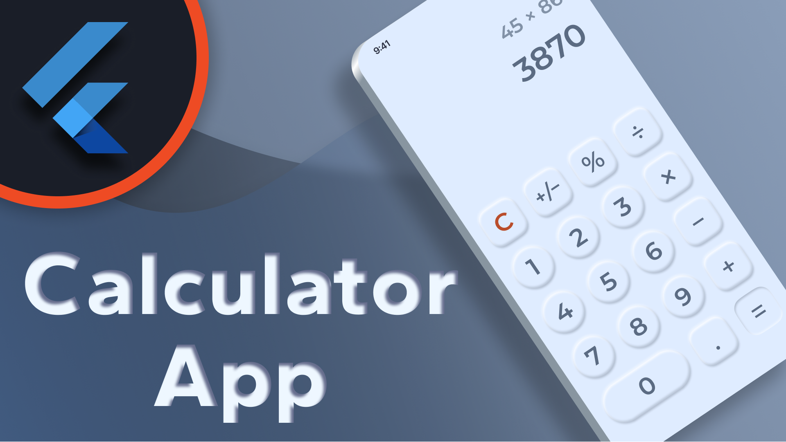

# Calculator App

This project will guide you through the process of developing a calculator app with a neat design. You will learn how to use neumorphism to create a nice 3D effect on the buttons. For the logic part of our calculator, we make use of the riverpod package.

---

☕️ Creating these videos requires a lot of time and effort. If you enjoy my content you can buy me a coffee so I can produce more videos during the night:

[**Support DebugErrorX**](https://www.buymeacoffee.com/debugerrorx)

Thank you!

---

## [Watch it on YouTube](https://www.youtube.com/watch?v=56Q0-i_gSX4)

 

---

You want more Flutter content? Check out my YouTube channel [**DebugErrorX**](https://www.youtube.com/channel/UCtY6vtwLqivmnquY1fg-BkQ)
- [Recent Flutter Videos](https://www.youtube.com/channel/UCtY6vtwLqivmnquY1fg-BkQ/videos)
- [Subscribe to DebugErrorX](https://www.youtube.com/channel/UCtY6vtwLqivmnquY1fg-BkQ?sub_confirmation=1)